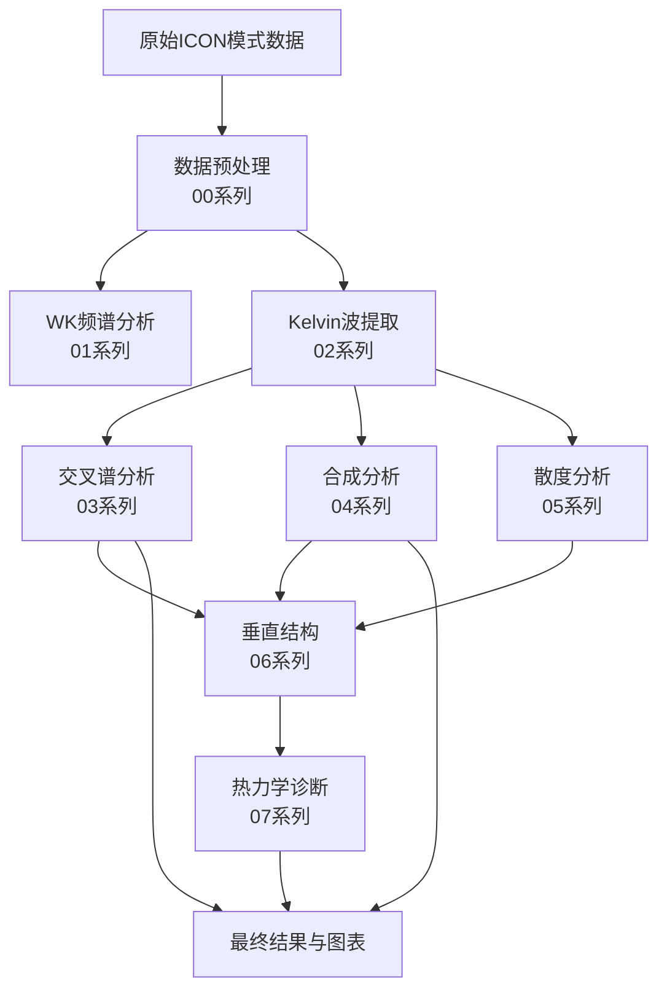

# CCKW Analysis Code Repository

> **对流耦合Kelvin波（CCKW）分析代码集**  
> **作者**: Jianpu | **机构**: Hohai University | **邮箱**: xianpuji@hhu.edu.cn

---

## 📑 目录

- [项目概述](#项目概述)
- [代码结构](#代码结构)
- [核心分析流程](#核心分析流程)
- [脚本详细说明](#脚本详细说明)
- [使用指南](#使用指南)
- [依赖环境](#依赖环境)

---

## 项目概述

本代码库包含用于分析对流耦合Kelvin波（Convectively Coupled Kelvin Wave, CCKW）的完整分析流程，
基于ICON气候模式的模拟数据，研究不同气候情景下（控制试验、+4K增温）Kelvin波的特征变化。

**主要研究内容**：
- Wheeler-Kiladis频谱分析
- Kelvin波的提取与合成分析
- 交叉谱分析（降水-OLR、LHF-散度等）
- 垂直结构与湿度场分析
- 传播特征与生命周期统计

---

## 代码结构

### 📊 按功能分类

#### **1. 数据预处理系列** (Data Preprocessing)

| 编号 | 文件名 | 功能描述 |
|------|--------|----------|
| 00-1 | `process_3d_data_optimized.py` | 3D大气数据处理（优化版，防内存崩溃） |
| 00-2 | `process_sea_land_mask.py` | 海陆掩膜数据处理 |
| 00-3 | `Python_Only_data_preprocess.ipynb` | 纯Python数据预处理流程 |
| 00-4 | `Python_merge_3D.ipynb` | 3D数据合并 |
| 00-5 | `Data_preprocess_for_uw_wind.ipynb` | 风场数据预处理 |
| 00-6 | `Data_preprocess_for_30_lattitude.ipynb` | 30°纬度范围数据预处理 |
| 00-7 | `01_trop_wmo_ICON.ncl` | NCL脚本：计算WMO对流层顶高度 |

#### **2. Wheeler-Kiladis频谱分析** (WK Spectrum Analysis)

| 编号 | 文件名 | 功能描述 |
|------|--------|----------|
| 01-1 | `01_Cal_wk_kelvin.ipynb` | 计算Wheeler-Kiladis频谱（Kelvin波） |
| 01-2 | `Cal_spectrum_year_by_year.ipynb` | 逐年频谱分析 |

#### **3. Kelvin波提取与滤波** (Wave Filtering)

| 编号 | 文件名 | 功能描述 |
|------|--------|----------|
| 02-1 | `wave_filter.py` | Kelvin波滤波模块（使用Dask） |
| 02-2 | `Cal_cckw_filter_3d_fields.ipynb` | 3D场的Kelvin波滤波 |
| 02-3 | `Cal_cckw_filter_for_hus.ipynb` | 比湿场的Kelvin波滤波 |
| 02-4 | `Cal_cckw_std_distribution.ipynb` | Kelvin波标准差分布 |
| 02-5 | `Cal_+4K_data_kelvin.ipynb` | +4K情景下的Kelvin波分析 |

#### **4. 交叉谱分析** (Cross-Spectrum Analysis)

| 编号 | 文件名 | 功能描述 |
|------|--------|----------|
| 03-1 | `Cal_cross_specturm.ipynb` | 基础交叉谱计算 |
| 03-2 | `Cal_cross_specturm_with_51.ipynb` | Level-51层的交叉谱分析 |
| 03-3 | `Cal_cross_specturm_with_pywk99.ipynb` | 使用pywk99库的交叉谱分析 |
| 03-4 | `02_1_Cal_cross_specturm_specific_layter.ipynb` | 特定层的交叉谱分析 |
| 03-5 | `02_1.1_test_level-55_cross_specturm.ipynb` | Level-55层测试 |
| 03-6 | `02_1.2_cal_cs_wdhdz.ipynb` | 计算ω·dh/dz交叉谱 |
| 03-7 | `02_1.2_cal_cs_wdhdz_normalized.ipynb` | 归一化的ω·dh/dz交叉谱 |
| 03-8 | `05_cal_pr&olr_cross_spectrum.ipynb` | 降水-OLR交叉谱 |
| 03-9 | `05_cal_pr_lhf_cross_spectrum.ipynb` | 降水-潜热通量交叉谱 |
| 03-10 | `05_cal_divergence&LHF_cross_spectrum.ipynb` | 散度-LHF交叉谱 |
| 03-11 | `05_cal_mseverticalconvection_pr_lhf_cross_spectrum.ipynb` | MSE垂直对流交叉谱 |
| 03-12 | `fig11_calculate_crossspectrum.ipynb` | 图11：交叉谱计算 |
| 03-13 | `fig11_plot_crossspectrum_clean.ipynb` | 图11：交叉谱绘图 |

#### **5. 合成分析** (Composite Analysis)

| 编号 | 文件名 | 功能描述 |
|------|--------|----------|
| 04-1 | `Cal_composite_kelvin.ipynb` | Kelvin波相位合成分析 |
| 04-2 | `Cal_composite_kelvin_hus.ipynb` | 比湿场的Kelvin波合成 |
| 04-3 | `Cal_composite_kelvin_vertical_profile.ipynb` | Kelvin波垂直剖面合成 |
| 04-4 | `Cal_composite_pre_with_long.ipynb` | 降水场的经度合成 |
| 04-5 | `Cal_pr_regression_composite.ipynb` | 降水回归合成 |
| 04-6 | `09_Cal_LHF_composite_with_time.ipynb` | 潜热通量的时间合成 |
| 04-7 | `09_cal_LHF_composite_with_lon.ipynb` | 潜热通量的经度合成 |
| 04-8 | `Cal_LHF_composite_with_time.ipynb` | LHF时间合成（备份） |
| 04-9 | `Cal_LHF_composite_with_lon.ipynb` | LHF经度合成（备份） |

#### **6. 散度与垂直运动** (Divergence & Vertical Motion)

| 编号 | 文件名 | 功能描述 |
|------|--------|----------|
| 05-1 | `02_0_Cal_divergence_of_wind_speed.ipynb` | 风速散度计算 |
| 05-2 | `02_0.0_Cal_divergence_of_wind_speed.ipynb` | 风速散度计算（改进版） |
| 05-3 | `03_Cal_wadhdz.ipynb` | 计算ω·dh/dz项 |
| 05-4 | `05_Cal_div_interp_pressure_level.ipynb` | 散度插值到气压层 |
| 05-5 | `05_Cal_div_into_specific_pre.ipynb` | 散度插值到特定气压层 |
| 05-6 | `05_Plot_cross_spe_div_pre_level.ipynb` | 绘制气压层散度交叉谱 |

#### **7. 垂直结构分析** (Vertical Structure)

| 编号 | 文件名 | 功能描述 |
|------|--------|----------|
| 06-1 | `07_plot_hus_vertical_composite.ipynb` | 比湿垂直合成图 |
| 06-2 | `07_plot_space_vertical_composite.ipynb` | 空间垂直合成图 |
| 06-3 | `Cal_composite_kelvin_vertical_profile.ipynb` | Kelvin波垂直剖面 |
| 06-4 | `Cal_temperature_profile.ipynb` | 温度垂直剖面 |
| 06-5 | `Cal_temperature_height_only_cold_point.ipynb` | 冷点层温度高度 |

#### **8. 热力学诊断** (Thermodynamic Diagnostics)

| 编号 | 文件名 | 功能描述 |
|------|--------|----------|
| 07-1 | `Cal_MSE.ipynb` | 湿静力能（MSE）计算 |
| 07-2 | `Cal_dhdt.ipynb` | dh/dt项计算 |
| 07-3 | `Cal_flux.ipynb` | 能量通量计算 |
| 07-4 | `Cal_Radiation.ipynb` | 辐射项计算 |
| 07-5 | `06_Cal_difference_qs_qa_allregion.ipynb` | 饱和比湿与实际比湿差异（全区域） |
| 07-6 | `Cal_difference_qs_qa.ipynb` | 饱和比湿与实际比湿差异 |
| 07-7 | `Cal_effective_potential_temperature.ipynb` | 有效位温计算 |
| 07-8 | `12_1_calculate_dqdz.ipynb` | 计算dq/dz |
| 07-9 | `12_1_calculate_dry_static_stability.ipynb` | 干静力稳定度 |

#### **9. 大气密度与质量** (Density & Mass)

| 编号 | 文件名 | 功能描述 |
|------|--------|----------|
| 08-1 | `04_Cal_full_level_of_rho.ipynb` | 完整层的空气密度计算 |
| 08-2 | `Cal_omega_region_mean.ipynb` | ω场区域平均 |

#### **10. 降水与蒸发** (Precipitation & Evaporation)

| 编号 | 文件名 | 功能描述 |
|------|--------|----------|
| 09-1 | `Cal_precipitation.ipynb` | 降水分析 |
| 09-2 | `Cal_evaporation_minus_precipitation.ipynb` | E-P计算 |

#### **11. 地表变量** (Surface Variables)

| 编号 | 文件名 | 功能描述 |
|------|--------|----------|
| 10-1 | `Cal_surface_wind_speed.ipynb` | 地表风速 |
| 10-2 | `Cal_relative_humidity_t2m.ipynb` | 2米相对湿度 |
| 10-3 | `Cal_SST_clean.ipynb` | 海表温度（清洗版） |

#### **12. EOF分析** (EOF Analysis)

| 编号 | 文件名 | 功能描述 |
|------|--------|----------|
| 11-1 | `Cal_wa_xeof.ipynb` | ω场的EOF分析 |
| 11-2 | `wa_xeof.ipynb` | ω场EOF分析（备份） |

#### **13. 时空分析** (Spatiotemporal Analysis)

| 编号 | 文件名 | 功能描述 |
|------|--------|----------|
| 12-1 | `Cal_homoller.ipynb` | Hovmöller图绘制 |
| 12-2 | `Cal_with_trop_wmo_from_NCL.ipynb` | 结合NCL计算的对流层顶分析 |

#### **14. 其他分析** (Miscellaneous)

| 编号 | 文件名 | 功能描述 |
|------|--------|----------|
| 13-1 | `Cal_different_resolution.ipynb` | 不同分辨率对比 |
| 13-2 | `Tas_vs_Snowcover_Albedo_NA_DJF_modify.ipynb` | 地表温度vs积雪反照率分析 |
| 13-3 | `tes.ipynb` | 测试脚本 |

#### **15. 工具脚本** (Utility Scripts)

| 编号 | 文件名 | 功能描述 |
|------|--------|----------|
| 14-1 | `auto_commit.sh` | 自动Git提交脚本 |
| 14-2 | `clean_cache.sh` | 清理缓存脚本 |
| 14-3 | `process_config.yml` | 处理配置文件 |
| 14-4 | `kelvin.yaml` | Kelvin波配置 |

---

## 核心分析流程



### 典型工作流程

1. **数据准备阶段**
   - 使用 `process_3d_data_optimized.py` 处理3D大气场
   - 使用 `process_sea_land_mask.py` 处理海陆掩膜
   - 运行 `Data_preprocess_*.ipynb` 进行特定预处理

2. **频谱诊断阶段**
   - `01_Cal_wk_kelvin.ipynb`：计算WK频谱，识别Kelvin波信号
   - `Cal_spectrum_year_by_year.ipynb`：检查年际变化

3. **波动提取阶段**
   - `wave_filter.py` + `Cal_cckw_filter_3d_fields.ipynb`：提取Kelvin波信号
   - `Cal_cckw_std_distribution.ipynb`：分析波动强度分布

4. **交叉谱分析阶段**
   - `05_cal_pr&olr_cross_spectrum.ipynb`：降水-OLR关系
   - `05_cal_pr_lhf_cross_spectrum.ipynb`：降水-潜热关系
   - `02_1.2_cal_cs_wdhdz.ipynb`：垂直对流项分析

5. **合成分析阶段**
   - `Cal_composite_kelvin.ipynb`：基于波动相位的合成
   - `Cal_composite_kelvin_vertical_profile.ipynb`：垂直剖面合成
   - `09_Cal_LHF_composite_with_time.ipynb`：时间演变合成

6. **诊断计算阶段**
   - `Cal_MSE.ipynb`：能量收支
   - `Cal_dhdt.ipynb`：局地变化
   - `Cal_flux.ipynb`：通量散度

---

## 脚本详细说明

### 🔧 核心工具脚本

#### `process_3d_data_optimized.py`
**功能**：优化的3D大气数据处理（防内存崩溃）

**特点**：
- ✅ 时间分块处理
- ✅ 智能内存监控
- ✅ 自动重试机制
- ✅ 增量保存
- ✅ Dask优化配置

**使用示例**：
```python
from process_3d_data_optimized import process_single_variable_chunked

save_path = process_single_variable_chunked(
    experiment_name="CNTL",
    variable_name="ta",
    level_indices=[55],
    dataset_key="AMIP_CNTL_ta",
    save_dir="/path/to/save",
    grid_dict={"nside": 256, "nest": True, "minmax_lat": 36},
    target_lat=np.arange(-36, 36.1, 2.0),
    target_lon=np.arange(0, 360, 2.0),
    time_chunk_size=365*5,  # 每次处理5年
    catalog=cat
)
```

#### `wave_filter.py`
**功能**：Kelvin波滤波模块

**核心类**：`CCKWFilter`
- 基于Wheeler & Kiladis (1999)方法
- 使用Dask并行处理
- 支持Kelvin波和ER波

**使用示例**：
```python
from wave_filter import CCKWFilter

wave_filter = CCKWFilter(
    ds='pr_data.nc',
    wave_name='kelvin',
    sel_dict={'lat': slice(-15, 15)},
    spd=1,
    n_workers=4
)
filtered_data = wave_filter.process()
```

### 📊 关键分析脚本

#### `01_Cal_wk_kelvin.ipynb`
**目的**：计算Wheeler-Kiladis频谱

**输入**：
- OLR或降水日数据
- 纬度范围：-15°至15°

**输出**：
- 对称/反对称分量功率谱
- 背景谱
- 显著性检验结果

**关键步骤**：
1. 数据加载与预处理
2. 对称/反对称分解
3. 2D FFT计算
4. 平滑与归一化
5. 绘制频谱图

#### `05_cal_pr&olr_cross_spectrum.ipynb`
**目的**：降水-OLR交叉谱分析

**输入**：
- 降水日数据
- OLR日数据

**输出**：
- 交叉功率谱
- 相干性平方
- 相位差

**物理意义**：
- 相干性高：降水与OLR强耦合
- 相位差：对流发展的时间滞后

#### `Cal_composite_kelvin.ipynb`
**目的**：基于Kelvin波相位的合成分析

**方法**：
1. 提取Kelvin波信号
2. 检测波动峰值
3. 按相位分类
4. 合成各变量场

**输出**：
- 8个相位的合成场
- 传播特征
- 生命周期统计

#### `Cal_MSE.ipynb`
**目的**：湿静力能（MSE）收支计算

**计算公式**：
```
MSE = Cp*T + g*Z + L*q
∂MSE/∂t = -∇·(V·MSE) - ∇·(ω·MSE/∂p) + Q + E
```

**输出**：
- MSE水平平流
- MSE垂直平流
- 辐射加热
- 地表通量

---

## 使用指南

### 环境配置

**推荐环境**：
```bash
conda create -n cckw_analysis python=3.10
conda activate cckw_analysis

# 安装核心依赖
pip install xarray dask netCDF4 scipy numpy pandas matplotlib cartopy cmaps

# 安装分析工具
pip install xeofs pywavelets scikit-image

# 安装本地wave_tools包
cd /work/mh1498/m301257/wave_tools
pip install -e .
```

**配置文件**：
- `kelvin.yaml`：Kelvin波滤波参数
- `process_config.yml`：数据处理配置

### 快速开始

#### 1. 处理原始数据
```bash
# 处理3D温度场
python process_3d_data_optimized.py

# 处理海陆掩膜
python process_sea_land_mask.py
```

#### 2. 运行WK频谱分析
```bash
jupyter notebook 01_Cal_wk_kelvin.ipynb
```

#### 3. 提取Kelvin波
```bash
jupyter notebook Cal_cckw_filter_3d_fields.ipynb
```

#### 4. 交叉谱分析
```bash
jupyter notebook 05_cal_pr&olr_cross_spectrum.ipynb
```

#### 5. 合成分析
```bash
jupyter notebook Cal_composite_kelvin.ipynb
```

### 批量处理

使用自动化脚本：
```bash
# 自动提交更改
bash auto_commit.sh

# 清理缓存
bash clean_cache.sh
```

---

## 依赖环境

### 核心依赖
```
numpy >= 1.19.0
xarray >= 0.16.0
dask >= 2021.0.0
scipy >= 1.5.0
matplotlib >= 3.3.0
pandas >= 1.1.0
netCDF4 >= 1.5.0
```

### 科学计算
```
xeofs >= 1.0.0          # EOF分析
pywavelets >= 1.1.0     # 小波分析
scikit-image >= 0.18.0  # Radon变换
```

### 气象专用
```
cartopy >= 0.18.0       # 地图投影
cmaps                   # NCL色标
metpy                   # 气象计算（可选）
```

### 模型数据
```
intake >= 0.6.0         # 数据目录
intake-esm >= 2021.0.0  # ESM数据集
```

---

## 数据来源

**模式**：ICON (ICOsahedral Nonhydrostatic)  
**分辨率**：R2B05 (~50km)  
**实验设计**：
- **CNTL**：AMIP控制试验（1980-2014）
- **P4K**：+4K SST均匀增温试验
- **4CO2**：CO2浓度翻倍试验

**变量列表**：
- 降水（pr）
- 外出长波辐射（rlut）
- 温度（ta）
- 比湿（hus）
- 纬向风（ua）、经向风（va）
- 垂直速度（wa）
- 潜热通量（hfls）

---

## 引用

如果使用本代码进行研究，请引用：

```bibtex
@software{cckw_analysis_2026,
  author = {Jianpu},
  title = {CCKW Analysis Code Repository},
  year = {2026},
  institution = {Hohai University},
  email = {xianpuji@hhu.edu.cn}
}
```

**相关文献**：
- Wheeler, M., & Kiladis, G. N. (1999). Convectively coupled equatorial waves. *Journal of the Atmospheric Sciences*, 56(3), 374-399.
- Kiladis, G. N., et al. (2009). Convectively coupled equatorial waves. *Reviews of Geophysics*, 47(2).

---

## 联系方式

- **作者**：Jianpu
- **邮箱**：xianpuji@hhu.edu.cn
- **机构**：Hohai University (河海大学)
- **GitHub**：https://github.com/Blissful-Jasper/CCKW_MPI

---

## 更新日志

- **2026-02-16**：创建完整的代码文档和索引
- **2025-12**：添加优化的数据处理脚本
- **2025-11**：完成主要分析流程

---

**最后更新**：2026-02-16
